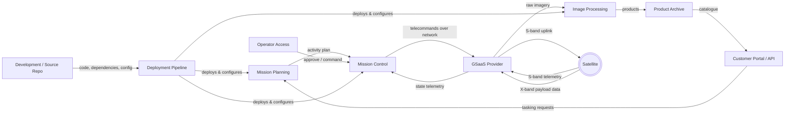

# Reference Architecture — Vulpine-Earth Ground Segment

## Components

### Customer Portal / API

### Mission Planning

### Mission Control

### GSaaS Provider

### Image Processing

### Product Archive

### Operator Access

### Deployment Pipeline

### Development / Source Repo
